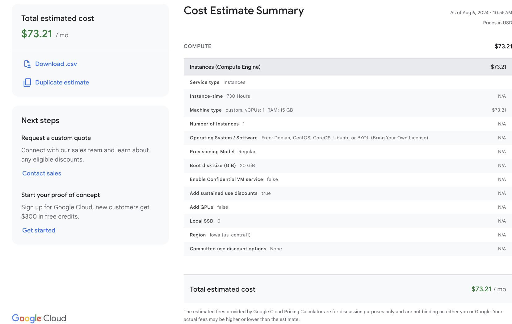
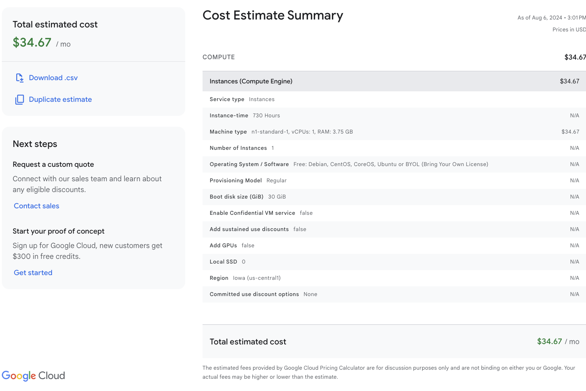

# Google Could Guide

## Cost Comparison

1. Hosting Ollama and Open WebUI together.
    

2. Hosting with [pipeline](https://docs.openwebui.com/pipelines/) features. This allows the application connecting to external model apis other than OpenAI and Ollama. It requires the developers to build pipeline themselves. See [example](https://github.com/open-webui/pipelines/tree/main/examples/pipelines). Additional API fees might apply based on the provider.

    


3. Hosting with OpenAI API endpoints only. Cost should be similar to above. Additional API fees might apply based on the provider.


## Deployment on GCE

1. Create an instance on GCE. Disk storage set to `40GB`
2. ssh the VM instance just created
3. make a working directory `mkdir webui-projects` and navigate to it `cd webui-projects`

**The following steps are for Ollama installation. You should alter it to suit your needs.**
4. pull Ollama by 

    sudo bash 
    curl -fsSL https://ollama.com/install.sh | sh


5. test if Ollama is intalled and start

    ```bash
    service ollama start
    ollama list
    ```

6. install a preferred model from Ollama

    ```bash
    ollama run mistral
    ```

<!-- 1. Follow [Create Your Project](https://cloud.google.com/appengine/docs/standard/python3/building-app/creating-gcp-project) till Step 5
2. Run the following in your terminal

    ```bash
    gcloud config configurations create [CONFIG_NAME] --activate
    gcloud config configurations list # check if its created
    gcloud config set project [PROJECT_ID]
    gcloud config set account [YOUR_ACCOUNT]
    gcloud auth login
    gcloud config configurations list # check if the setting is correct
    gcloud app create
    ``` -->
